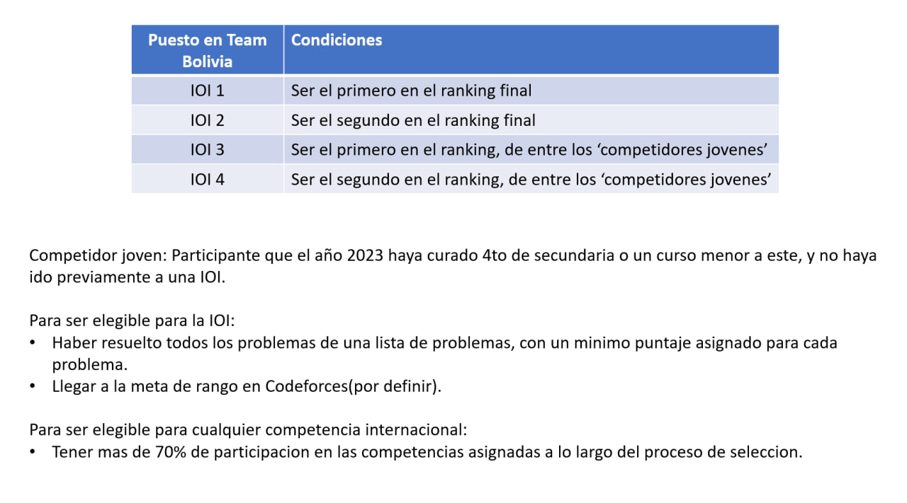

# Pre-selección 2023-2024

La preselección es un grupo de estudiantes bolivianos, ganadores de la etapa departamental de la OBI (Olimpiada Boliviana de Informática), que se preparan para la etapa nacional de la OBI y aspiran a ser parte de la selección boliviana de informática en las distintas olimpiadas internacionales.

El año 2024 se realizará la [IOI (International Olympiad in Informatics)](https://ioinformatics.org) en **Egipto**. La preselección 2023-2024 esta sobre todo enfocada en preparar a los estudiantes para esta olimpiada y elegir a los 4 representantes de Bolivia.

Mas detalles son dados en el [documento](https://drive.google.com/file/d/1-dBKkdO75zv_054Qd1Jiw6r4UNNfRUbN/view?usp=sharing).

Todo competidor que forma parte de la preselección ha sido contactado por el equipo de la OBI, si no es así, por favor contactar a los organizadores:
- Correos electrónicos: obi@jhtan.com - info@obi.org.bo
- Instagram: https://www.instagram.com/obi_informatica
- Telegram: https://t.me/olimpiadabolivianadeinformatica
- Esclavo de la preselección(_Diego Angulo_): [Telegram](https://t.me/diegopenguino) - diegoangulo5@gmail.com

## Elegibilidad para Olimpiadas Internacionales

## Bolivia en Olimpiadas Internacionales:
- 4 cupos para la [IOI (International Olympiad in Informatics)](https://stats.ioinformatics.org/delegations/BOL).
- 10 cupos para la [OII (Olimpiada Iberoamericana de Informática)](https://www.iberoinformatica.org/countries) + 5 cupos invitados.

## Links importantes:
- [__RANKING__](https://docs.google.com/spreadsheets/d/1afOv6X_cwJJczoVRYSFtDynjn0t37giU/edit?usp=sharing&ouid=108406773872541211965&rtpof=true&sd=true)
- [_Reglas de la preselección_](https://drive.google.com/file/d/1-dBKkdO75zv_054Qd1Jiw6r4UNNfRUbN/view?usp=sharing)
- [_Canal de anuncios_](https://t.me/+LagfqmNDfhZkMDgx)
- _Ranking_
- [_Fechas de clases_](https://docs.google.com/spreadsheets/d/1PPQgUjml65GxCkA18FocPn35yWTEFxdXmlsYXOkZrjA/edit?usp=sharing)
- [_Recursos de las clases_](https://github.com/Olimpiada-Boliviana-De-Informatica/RecursosOBI/tree/main/Preseleccion_2023-2024)
- [_Lista de competencias_](https://docs.google.com/spreadsheets/d/1afOv6X_cwJJczoVRYSFtDynjn0t37giU/edit#gid=357604937)
- [_Lista de recursos creada por Diego_](https://diegopenguino.github.io/resources_for_cp)
